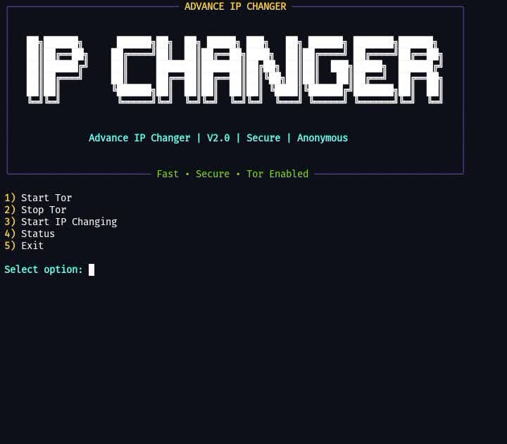
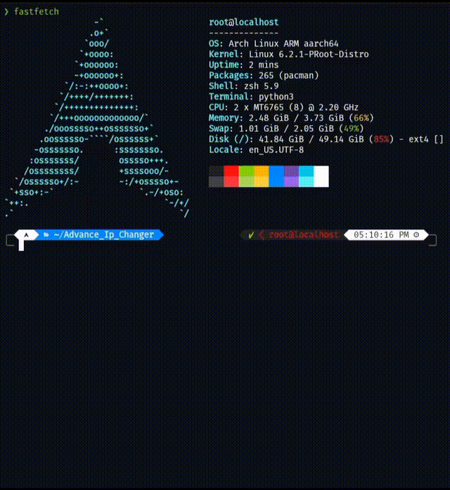

<p align="center">
  
</p>

<h1 align="center">Advance IP Changer</h1>

<p align="center">
  An automated IP rotation tool powered by Tor — built for anonymity, testing, and secure connections.
</p>

---
## 📸 Screenshot
<p align="center">
  
</p>
---
### 🧠 Description

**Advance IP Changer** is a lightweight Python-based tool designed to automatically change your public IP address at defined intervals using the Tor network.  
It is ideal for developers, penetration testers, and privacy-focused users who need quick IP rotation from the terminal.

---
<p align="center">
  
  
  
  
  
  
  
  <a href="https://github.com/Ritusmin325k">
    
  </a>
  <a href="https://www.instagram.com/nullsenpai_31">
    
  </a>
</p>
---
### ⚙️ Features

- 🌀 Auto IP rotation (configurable time interval)  
- 🌍 Uses the Tor network for anonymity  
- 📊 Displays current IP before and after rotation  
- 🧩 Works on Termux, Proot-distro, and Linux systems  
- 🔒 Keeps your session secure and private  

---

### 🛠️ Requirements

- Python 3.9+  
- Tor  
- `requests`, `stem`, `rich`, `pysocks` Python modules  

Install Python deps:
```bash
pip3 install -r requirements.txt

```

---

## 📥 Download & Install (by platform)

Choose your environment and follow the commands.

### Termux (Android)
```bash
# update package lists
pkg update -y

# install required packages
pkg install -y tor python git curl netcat

# install python modules
pip install --upgrade pip
pip3 install -r requirements.txt

# clone repo
git clone https://github.com/Ritusmin325k/Advance-IP-Changer.git
cd Advance-IP-Changer
chmod +x advance_ip_changer.py tor_manager.sh

# prepare tor config and start
mkdir -p $HOME/.tor
echo "ControlPort 9051" > $HOME/.tor/torrc
echo "CookieAuthentication 1" >> $HOME/.tor/torrc
tor -f $HOME/.tor/torrc &

# run the tool
python3 advance_ip_changer.py
```

Notes:
- Termux has no systemd. Start Tor with `tor -f $HOME/.tor/torrc &` each session or use a Termux service wrapper.

---

### Proot-distro (Arch Linux)
```bash
# inside proot Arch shell (you are root inside proot)
pacman -Syu --noconfirm
pacman -S --noconfirm tor python git curl netcat

# install python modules
pip install --upgrade pip
pip3 install -r requirements.txt

# clone and run
git clone https://github.com/<your-username>/Advance-IP-Changer.git
cd Advance-IP-Changer
chmod +x advance_ip_changer.py tor_manager.sh

# Configure torrc in your home
mkdir -p ~/.tor
echo "ControlPort 9051" > ~/.tor/torrc
echo "CookieAuthentication 1" >> ~/.tor/torrc

# Start tor (no systemd)
tor -f ~/.tor/torrc &
python3 advance_ip_changer.py
```

If systemd is available in the environment:
```bash
systemctl enable --now tor.service
```

---

### Debian / Ubuntu (Debian-based Linux)
```bash
# update
sudo apt update && sudo apt upgrade -y

# install tor and tools
sudo apt install -y tor curl git netcat python3 python3-pip

# install python modules
pip3 install -r requirements.txt

# clone repo
git clone https://github.com/<your-username>/Advance-IP-Changer.git
cd Advance-IP-Changer
chmod +x advance_ip_changer.py tor_manager.sh

# configure tor
sudo mkdir -p /var/lib/tor
mkdir -p $HOME/.tor
echo "ControlPort 9051" > $HOME/.tor/torrc
echo "CookieAuthentication 1" >> $HOME/.tor/torrc

# start tor (systemd)
sudo systemctl enable --now tor.service

# OR (if you want to run user tor instance)
tor -f $HOME/.tor/torrc &

# run tool
python3 advance_ip_changer.py
```

---

## 🔧 Configure Tor ControlPort (detailed)

Two secure ways to enable programmatic NEWNYM:

**A) CookieAuthentication (recommended for local scripts)**  
Add to torrc:
```
ControlPort 9051
CookieAuthentication 1
```
Restart Tor. Your scripts that use `stem` can authenticate via the cookie automatically:
```python
from stem.control import Controller
with Controller.from_port(port=9051) as controller:
    controller.authenticate()  # uses cookie
    controller.signal("NEWNYM")
```

**B) HashedControlPassword (password-based)**  
1. Generate a hash:
```bash
tor --hash-password "yourpass"
# copy the HashedControlPassword output
```
2. Add to torrc:
```
ControlPort 9051
HashedControlPassword <HASH_HERE>
```
3. Restart Tor. Authenticate from Python:
```python
from stem.control import Controller
with Controller.from_port(port=9051) as controller:
    controller.authenticate(password="yourpass")
    controller.signal("NEWNYM")
```

**Restart Tor (systemd)**:
```bash
sudo systemctl restart tor
```
**Manual user tor instance**:
```bash
tor -f $HOME/.tor/torrc &
```

---

## ✅ Verify Tor is running & SOCKS proxy

Check listeners:
```bash
# should show 127.0.0.1:9050 (SOCKS) and 127.0.0.1:9051 (Control)
ss -tuln | grep -E "9050|9051"
```

Test proxy with curl:
```bash
curl --socks5-hostname 127.0.0.1:9050 https://check.torproject.org/api/ip
# should return the Tor exit IP JSON or just the IP depending on endpoint
```

Test with Python (requests + pysocks):
```python
import requests
proxies = {'http':'socks5h://127.0.0.1:9050', 'https':'socks5h://127.0.0.1:9050'}
print(requests.get('https://api.ipify.org?format=text', proxies=proxies, timeout=10).text)
```

---

## 🛑 Troubleshooting

- **403 or blocked pages**: Some services block Tor exits. Try another endpoint (e.g., `https://check.torproject.org/api/ip`).  
- **Real IP still visible**: Ensure you proxy the request through `socks5h://127.0.0.1:9050`. Browser not automatically proxied.  
- **Tor not starting**: Check logs `journalctl -u tor` or run `tor -f ~/.tor/torrc` to see errors.  
- **No systemd in Termux**: Start Tor manually or use Termux service helpers.

---
## Demo video 📷 
<p align="center">
  <br>
  
</p>
---
## 📁 Files included

```
Advance-IP-Changer/
├── advance_ip_changer.py
├── tor_manager.sh
├── install_requirements.sh
└── assets/
    ├── logo.png
    ├── screenshot.png
    └── video.gif
```

---

## 📜 License

MIT License © 2025 [Ritusmin Saikia](https://github.com/Ritusmin325k)

---


